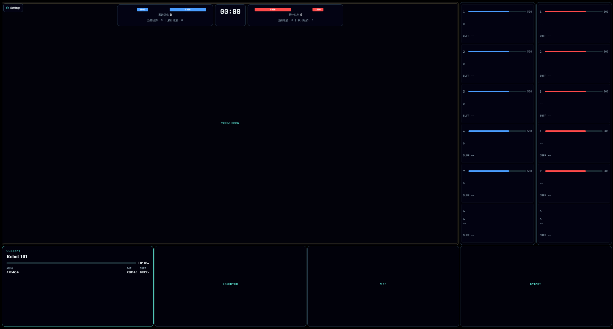

# Alliance Client

实时机器人对战的桌面客户端，基于 Avalonia 构建。通过 MQTT 接收遥测数据，通过 UDP 接收 HEVC 视频流，在 HUD 叠加层中实时展示比赛状态。



## 项目结构

```
Alliance-Client/
├── Alliance.sln
├── proto/
│   └── rm_client.proto          # Protobuf 消息定义（比赛状态、机器人状态等）
├── src/
│   └── Alliance.Client/
│       ├── Features/
│       │   ├── Control/         # 指令服务（发指令给机器人）
│       │   ├── Hud/             # HUD 叠加层 ViewModel
│       │   ├── Settings/        # 应用配置（appsettings.json 绑定）
│       │   ├── Telemetry/       # MQTT 遥测数据接收与状态存储
│       │   └── Video/           # UDP HEVC 视频流接收与解码
│       ├── Infrastructure/
│       │   ├── Bootstrap/       # DI 容器初始化
│       │   ├── Logging/         # 启动日志
│       │   └── Runtime/         # 运行时协调（启动/停止各服务）
│       ├── Shared/
│       │   ├── Models/          # 共享枚举与数据模型
│       │   └── Utils/           # 工具类（玩家身份解析等）
│       ├── Shell/               # 主窗口
│       └── Styles/              # UI 样式
└── tests/
    └── Alliance.Client.Tests/   # 单元测试
```

## 开发环境需求

| 组件 | 要求 |
|------|------|
| OS | Linux / Windows / macOS |
| .NET SDK | **10.0** 或更高 |
| IDE（可选） | JetBrains Rider / VS Code + C# Dev Kit / Visual Studio 2022 |
| FFmpeg | 用于 HEVC 解码，需确保 native library 在运行时可用 |

检查本机环境：

```bash
dotnet --version   # 应输出 10.0.x
```

## 编译与启动

### 还原依赖

```bash
dotnet restore
```

### 编译

```bash
dotnet build
```

### 运行

```bash
dotnet run --project src/Alliance.Client
```

### 运行测试

```bash
dotnet test
```

## 配置

运行时配置文件为 `src/Alliance.Client/appsettings.json`：

```json
{
  "ApplicationName": "Alliance Client",
  "EnableDebugMode": true,
  "Mqtt": {
    "Host": "192.168.12.1",
    "Port": 3333,
    "ClientId": "101"
  },
  "UdpVideo": {
    "ListenPort": 3334,
    "Codec": "hevc"
  }
}
```

本地调试时可创建 `appsettings.Local.json` 覆盖配置（已在 `.gitignore` 中排除）：

```json
{
  "Mqtt": {
    "Host": "localhost"
  }
}
```

### 配置项说明

| 字段 | 默认值 | 说明 |
|------|--------|------|
| `Mqtt.Host` | `192.168.12.1` | MQTT Broker 地址 |
| `Mqtt.Port` | `3333` | MQTT Broker 端口 |
| `Mqtt.ClientId` | `101` | MQTT 客户端 ID，纯数字，对应机器人编号 |
| `UdpVideo.ListenPort` | `3334` | UDP 视频流监听端口 |
| `UdpVideo.Codec` | `hevc` | 视频编码格式 |

## 架构说明

- **MVVM**：ViewModel 继承 `CommunityToolkit.Mvvm` 的 `ObservableObject`，通过 `ObservableProperty` / `SetProperty` 驱动 UI 更新
- **DI 容器**：`AppBootstrapper` 使用 `Microsoft.Extensions.DependencyInjection` 注册所有服务
- **数据流**：
  - `MqttTelemetryService` 订阅 MQTT topics，解析 Protobuf 消息，写入 `TelemetryStore`
  - `UdpHevcVideoStreamService` 监听 UDP 端口，组装 HEVC 帧并解码为位图
  - `TelemetryStore` 汇总所有状态，通过 `PropertyChanged` 通知 ViewModel 更新 HUD

### 主要服务

| 服务 | 接口 | 职责 |
|------|------|------|
| `MqttTelemetryService` | `ITelemetryService` | MQTT 连接、订阅、Protobuf 解析 |
| `UdpHevcVideoStreamService` | `IVideoStreamService` | UDP 接收、HEVC 解码 |
| `NoOpCommandService` | `ICommandService` | 指令发送（当前为空实现占位） |
| `TelemetryStore` | — | 全局状态存储，线程安全 |
| `AppRuntimeCoordinator` | — | 协调各服务的启动和停止 |

视频链路详细流程见 [docs/udp-3334-to-ui-image-flow.md](docs/udp-3334-to-ui-image-flow.md)，其中说明了从 UDP `3334` 监听、分片重组、HEVC 解码到 Avalonia `Image` 展示图像的完整路径。

## 开发指南

### 添加新的遥测字段

1. 在 `proto/rm_client.proto` 中定义新消息或扩展现有消息
2. `dotnet build` 自动生成 Protobuf C# 代码
3. 在 `TelemetryStore` 中添加对应的 `Apply` 方法
4. 在 `TelemetrySnapshot` 中添加展示字段
5. 在对应的 ViewModel 和 AXAML 视图中绑定新字段

### 添加新的 Feature

1. 在 `Features/` 下新建目录
2. 定义服务接口和实现
3. 在 `AppBootstrapper.cs` 中注册服务
4. 创建 ViewModel（继承 `ObservableObject`）
5. 创建对应的 `.axaml` 视图

### 样式修改

UI 样式文件在 `src/Alliance.Client/Styles/` 目录下，使用 Avalonia 的 AXAML 样式语法。

### Protobuf

proto 文件位于 `proto/` 目录，`GrpcServices="None"` 仅生成消息类型，不生成 gRPC 服务桩。如果需要添加 gRPC 服务，修改 `Alliance.Client.csproj` 中的 `GrpcServices` 属性。
